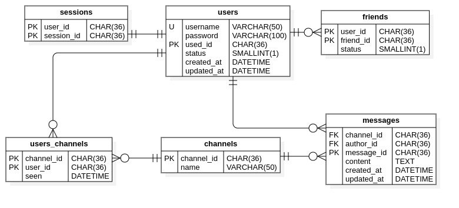

# Database Basic

## Nội dung

### MySQL

Note về [MySQL](mysql.md)

### Redis

Note về [Redis](redis.md)

## Bài tập

Thiết kế schema cho chương trình chat - trò chuyện (với Redis và với MySQL), sử dụng Python để tương tác.

Mô tả chương trình chat: cơ chế tương tự Zalo, Message.

### Thiết kế Relational Database

    

Source code cho [Chat App](https://github.com/tranphucbol/python-chat) 
