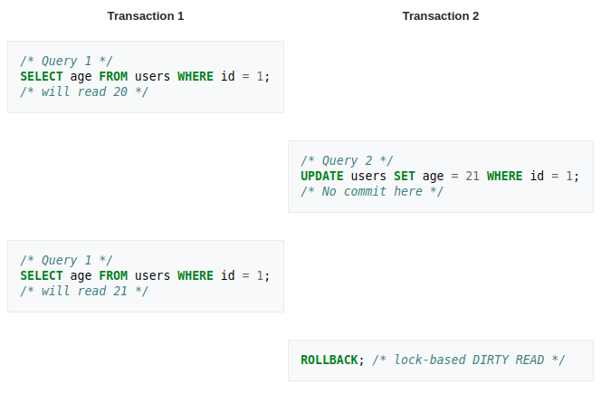
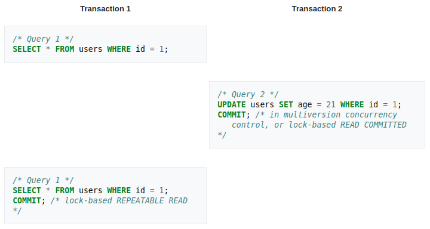
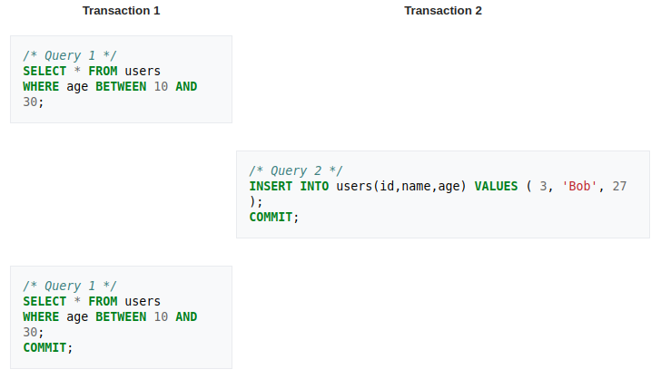
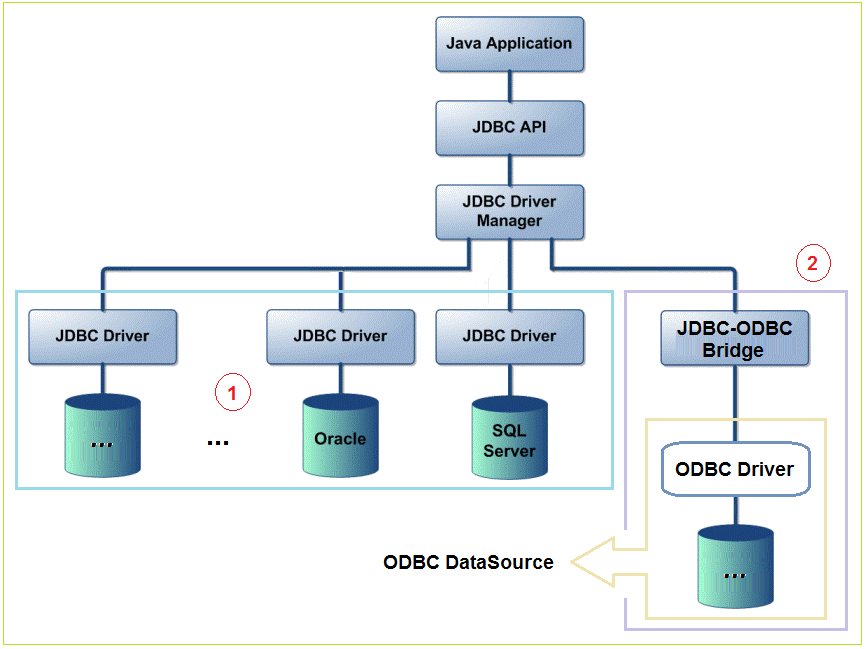

# MySQL

- [MySQL](#MySQL)
  - [Installation](#Installation)
  - [Storage Engine](#Storage-Engine)
    - [InnoDB](#InnoDB)
    - [MyISAM](#MyISAM)
    - [Memory](#Memory)
    - [CSV](#CSV)
    - [Federated](#Federated)
    - [Network Database (NDB)](#Network-Database-NDB)
  - [Data Types](#Data-Types)
    - [Numeric Types](#Numeric-Types)
    - [Date và Time Type](#Date-v%C3%A0-Time-Type)
    - [String Type](#String-Type)
    - [utf8mb4](#utf8mb4)
  - [Transaction](#Transaction)
    - [Tại sao sử dụng transaction](#T%E1%BA%A1i-sao-s%E1%BB%AD-d%E1%BB%A5ng-transaction)
    - [Cách sử dụng transaction](#C%C3%A1ch-s%E1%BB%AD-d%E1%BB%A5ng-transaction)
    - [Xử lý khi gặp lỗi trong transaction](#X%E1%BB%AD-l%C3%BD-khi-g%E1%BA%B7p-l%E1%BB%97i-trong-transaction)
    - [Distributed Database](#Distributed-Database)
      - [ACID](#ACID)
  - [Isolation](#Isolation)
    - [Isolation level cơ bản](#Isolation-level-c%C6%A1-b%E1%BA%A3n)
    - [Read Phenomena](#Read-Phenomena)
      - [Dirty reads](#Dirty-reads)
      - [Non-repeatable reads](#Non-repeatable-reads)
      - [Phantom reads](#Phantom-reads)
    - [Isolation xử lý đồng thời (concurrency)](#Isolation-x%E1%BB%AD-l%C3%BD-%C4%91%E1%BB%93ng-th%E1%BB%9Di-concurrency)
      - [Serializable](#Serializable)
      - [Read Committed](#Read-Committed)
      - [Repeatable read](#Repeatable-read)
      - [Read Uncommitted](#Read-Uncommitted)
  - [Connector](#Connector)
    - [JDBC Driver](#JDBC-Driver)
    - [Python Driver](#Python-Driver)

## Installation

[Mysql](https://www.digitalocean.com/community/tutorials/how-to-install-mysql-on-ubuntu-18-04)

## Storage Engine

### InnoDB

*Ưu điểm:*

- Là một Storage Engine transaction-safe (tuân thủ ACID) có các commit, rollback, và khả năng khôi phục dữ liệu người dùng.
- Row-level locking của InnoDB và kiểu nonblocking read của Oracle-style làm tăng sự đồng thời và hiệu suất của người dùng.
- InnoDB lưu trữ dữ liệu người dùng trong các clustered indexes để giảm I/O cho các truy vấn thông thường dựa trên các primary key.
- Hỗ trợ ràng buộc toàn vẹn Foreign Key.

*Nhược điểm:*

- Tính ràng buộc cao
- Truy vấn sẽ phức tạp nếu như ràng buộc quá cao, liên kết nhiều bảng dẫn đến hiệu năng kém
- Khó cài đặt, khó sử dụng cho người mới bắt đầu.

### MyISAM

*Ưu điểm:*

- Đơn giản dễ sử dụng
- Gọn nhẹ, phù hợp cho các công việc read-only, hoặc read-mostly trong các cấu hình Web và lưu trữ dữ liệu

*Nhược điểm:*

- Table-level locking giới hạn hiệu suất read/write dữ liệu

### Memory

*Ưu điểm:*

- Lưu trữ dữ liệu trên RAM, nên có thể truy cập dữ liệu nhanh chóng

*Nhược điểm:*

- Do lưu trong RAM nên dữ liệu sẽ bị mất, khi MySQL Server tắt hoặc khởi động lại.
- Không thể chứa các cột **BLOB** hay **TEXT**

### CSV

*Ưu điểm:*

- Cấu trúc đơn giản, các trường được ngăn cách nhau bởi dấu phẩy.
- Có thể trao đổi dữ liệu, nhập xuất dữ liệu.
- Có thể đọc và viết bằng Microsoft Excel hoặc StarOffice Calc.

*Nhược điểm:*

- Không hỗ trợ ràng buộc

### Federated

*Ưu điểm:*

- Khả năng scalable lớn, do có thể truy cập nhiều MySQL Server từ nhiều remote server khác nhau.

*Nhược điểm:*

- Không hỗ trợ transaction
- Không hoạt động với query cache
- Việc join có thể rất phức tạp

### Network Database (NDB)

*Ưu điểm:*

- Có thể xử lý các lỗi của các node dữ liệu đơn lẻ mà không có tác động nào khác ngoài một số lượng nhỏ các giao dịch bị hủy bỏ do mất trạng thái giao dịch
- Các node đơn lẻ có thể  dừng hoặc khởi dộng lại.

*Nhược điểm:*

## Data Types

### Numeric Types

- **BIT[(M)]**
  - Một kiểu bit-value. **M** chỉ ra số bits của mỗi giá trị, từ 1 đến 64. Mặc định là 1 nếu **M** bị bỏ qua
- **TINYINT[(M)] [UNSIGNED] [ZEROFILL]**
  - Một số nguyên rất nhỏ. Số có dấu -128 đến 127. Số không dấu 0 đến 255
- **BOOL, BOOLEAN**
  - Kiểu dữ liệu này tương đương với **TINYINT(1)**. Giá trị 0 được xem là **'false'**. Giá trị khác 0 được xem **'true'**. Tuy nhiên, giá trị **TRUE** và **FALSE** tương ứng 1 với 0.
- **SMALLINT[(M)] [UNSIGNED] [ZEROFILL]**
  - Số nguyên nhỏ. kích thước 2 byte.
- **MEDIUMINT[(M)] [UNSIGNED] [ZEROFILL]**
  - Số nguyên với kích thước 3 byte.
- **INT[(M)] [UNSIGNED] [ZEROFILL]**
  - Kích thước thông thường 4 byte
- **INTEGER[(M)] [UNSIGNED] [ZEROFILL]**
  - Tương đương **INT**
- **BIGINT[(M)] [UNSIGNED] [ZEROFILL]**
  - Số nguyên lớn, kích thước 8 byte
  - **SERIAL** là thay thế cho **BIGINT UNSIGNED NOT NULL AUTO_INCREMENT UNIQUE**
- **DECIMAL[(M[,D])] [UNSIGNED] [ZEROFILL]**
  - **M** là tổng chữ số (độ chính xác) và D là số chữ đố sau dấu thập phân. Dấu thập phân và dấu âm (-) không được tính bằng **M**. Nếu **D** bằng 0, các giá trị không có dấu phận phân hoặc phần thập phân. Số chữ số tối đa **M** cho **DECIMAL** là 65. Số thập phân **D** được hỗ trợ tối đa là 30. Nếu **D** bị bỏ qua, mặc định là 0. Nếu **M** bị bỏ qua, mặc đinh là 10.
- **FLOAT(p) [UNSIGNED] [ZEROFILL]**
  - p là độ chính xác trong bits. Nhưng trong MySQL dùng giá trị này chỉ để xác định là dùng **FLOAT** hay **DOUBLE**. Nếu p là 0 -> 24, kiểu dữ liệu là **FLOAT** với không có **M** hoặc **D**. Nếu p là 25 -> 53, kiểu dữ liệu là **DOUBLE**.
- **DOUBLE[(M, D)] [UNSIGNED] [ZEROFILL]**
  - **M** là tổng số chữ số, **D** là số chữ số thập phân.

### Date và Time Type

- **DATE**
  - Khoảng từ `'1000-01-01` đến `'9999-12-31'`. MySQL hiển thị **DATE** theo định dạng `'YYYY-MM-DD'`, nhưng cho phép gán giá trị dùng `string` hoặc `number`
- **DATETIME[(fsp)]**
  - Là kết hợp của date và time. Khoảng từ `'1000-01-01 00:00:00.000000'` đến `'9999-12-31 23:59:59.999999'`. MySQL hiển thị **DATETIME** theo định dạng `'YYYY-MM-DD hh:mm:ss[.fraction]'` và cũng cho phép gán giá trị bằng `string` hoặc `number`
  - **fsp** khoảng từ 0 -> 6, biểu thị sự chính xác của giây. Nếu bỏ qua, giá trị mặc định là 0.
- **TIMESTAMP[(fsp)]**
  - Khoảng từ `'1970-01-01 00:00:01.000000' UTC` đến `'2038-01-19 03:14:07.999999' UTC`, tương tự như DATETIME, chỉ khác khoảng.
- **TIME[(fsp)]**
  - Khoảng từ `'-838:59:59.000000'` đến `'838:59:59.000000'`. MySQL hiển thị **TIME** theo định dạng `'hh:mm:ss[.fraction]'`
- **YEAR[(4)]**
  - Định dạng gồm 4 chữ số. Giá trị hiển thị từ 1901 đến 2155 và 0000.

### String Type

- **[NATIONAL] CHAR[(M)] [CHARACTER SET charset_name] [COLLATE collation_name]**
  - Chuỗi có độ dài cố định luôn được đệm khoảng trắng đến độ dài đã chỉ định. **M** nằm trong khoảng từ 0 đến 255. Nếu bỏ qua, **M** sẽ là 1
- **[NATIONAL] VARCHAR(M) [CHARACTER SET charset_name] [COLLATE collation_name]**
  - Chuỗi có động dài động. **M** là đọ dài tối đa của chuỗi. **M** nằm trong khoảng từ 0 đến 65535
- **TEXT[(M)] [CHARACTER SET charset_name] [COLLATE collation_name]**
  - Cột **TEXT** có độ dài tối đa là 65535 ($`2^{16}-1`$) kí tự. Mỗi giá trị **TEXT** được lưu trữ bằng tiền đố có độ dài 2 byte cho biết số lượng bute trong giá trị.

### utf8mb4

`utf8mb4` character set có các đặc điểm:

- Hỗ trợ và vác supplementary characters
- Yêu cầu tối đa 4 byte cho mỗi multibyte character

utf8mb4 khác với `utf8mb3` charactrer set, chỉ hỗ trợ các kí tự BMP và dùng số byte tối đa là 3 cho mỗi kí tự:

- Đối với một kí tự BMP, `utf8mb4` và `utf8mb3` có các đặc điểm lưu trữ giống nhau: cùng giá trị mã, cùng mã hóa, cùng độ dài.
- Đối với kí tự supplementary, `utf8mb4` yêu cầu 4 byte để lưu trữ, trong khi `utf8mb4` không thể lưu trữ tất cả các kí tự. Khi chuyển từ `utf8mb3` sang `utf8mb4`, bạn không cầ n lo lắng về kí tự bổ sung.

## Transaction

### Tại sao sử dụng transaction

`Transaction` được dùng để đảm bảo tính toàn vẹn dữ liệu khi xảy ra chỉnh sửa dữ liệu (INSERT, UPDATE, DELETE, ...). Khi một transaction bao gồm nhiều lệnh cập nhật, nó đảm bảo tất cả các cập nhật đều được thực hiện thành công, hoặc là tất cả đều thất bại. Khi đó, dữ liệu được trả về trước khi xảy ra `transaction`.

### Cách sử dụng transaction

Những câu lệnh cung cấp việc kiểm soát việc sử dụng transaction:

- `START TRANSACTION` hoặc `BEGIN` để bắt đầu một transaction mới.
- `COMMIT` để commit transaction hiện tại, là vĩnh viễn không thay đổi.
- `ROLLBACK` khôi phục transaction hiện tại, hủy bỏ các thay đổi của nó.
- `SET autocommit` vô hiệu hóa hoặc kích hoạt chế độ autocommit mặc định cho session hiện tại.

```sql
START TRANSACTION;
SELECT @A:=SUM(salary) FROM table1 WHERE type=1;
UPDATE table2 SET summary=@A WHERE type=1;
COMMIT;
```

Với `START TRANSACTION` autocommit sẽ bị vô hiệu hóa, đến khi bạn kết thúc transaction với `COMMIT` hoặc `ROlLBACK`. Chế độ autocommit sẽ được chuyển về trạng thái trước đó.

### Xử lý khi gặp lỗi trong transaction

Transaction sẽ tự động `ROLLBACK` khi gặp bất cứ lỗi nào xảy ra. Có thể tạo ra các `SAVEPOINT` để không phải `ROLLBACK` hoàn toàn transaction.

### Distributed Database

Distributed Database được xem là database transaction phải được đồng bộ hóa (hoặc cung cấp ACID) giữa nhiều database tham gia được phân phối giữa các địa điểm vật lý khác nhau. Thuộc tính isolation đạt ra một thách thức cho transaction đa database, vì thược tính tuần tự hóa có thể bị vi phạm, ngay cả khi mỗi database cung cấp nó.

#### ACID

- Tính nguyên tố (**Atomicity**). Một transaction bao gồm các hoạt động khác nhau phải thỏa mãn điều kiện hoặc là tất cả thành công hoặc là không hành động nào thành công
- Tính nhất quán (**Consistency**). Một transaction sẽ có trjang thái bất biến về dữ liệu có nghĩa là dữ liệu luôn được bảo toàn. Nếu có lỗi quay về trạng thái trước đó.
- Tính độc lập (**Isolation**). Một transaction đang thực thi và chưa được xác nhận phải bảo đảm tính độc lập với các transaction khác.
- Tính bền vững (**Durability**). Khi một transaction được commit thành công dữ liệu sẽ được lưu lại một cách chuẩn xác.

## Isolation

### Isolation level cơ bản

Mức Isolation tháp hơn làm tăng khả năng nhiều nguời dùng truy cập cùng một dữ liệu cùng một lúc, nhưng làm tăng số lượng hiệu ứng đồng thời (như dirty read hoặc cập nhật bị mất) người dùng có thể gặp phải. Ngược lại, Isolation cao hơn sẽ giảm các loại hiệu ứng đồng thời mà nguwoif dùng có thể gặp, nhưng đòi hởi nhiều tài nguyên hệ thống hơn và tăng khả năng một transaction sẽ chặn một transaction khác.

### Read Phenomena

#### Dirty reads

Dirty read xảy ra khi một transaction cho phép đọc dữ liệu từ một dòng được thay đổi bởi một transaction khác đang được chạy và chưa commit.

<div align="center">
    
</div>

#### Non-repeatable reads

Non-repeatable read xảy ra trong suốt quá trình của một transaction, một dòng truy xuất dữ liệu 2 lần và giá trị trong dòng khác nhau giữa các lần đọc.

<div align="center">
    
</div>

Trong ví dụ trên, transaction 2 commit thành công, tức là những thay dổi của nó đối với dòng có id 1 sẽ được hiển thị. Tuy nhiên, transaction 1 đã được thấy một giá trị khác của age trong dòng đó. Tại isolation level SERIALIZABLE và REPETABLE READ, DBMS phải trả về giá trị của cho lần SELECT thứ 2. Tại isolation level READ COMMITTED và READ UNCOMMITED, DBMS có thể trả về giá trị update, điều này là non-repeatable read.

#### Phantom reads

Phantom read xảy ra trong quá trình của một transaction, một dòng mới được thêm và xóa bởi một transaction khác vào các record đang được đọc.

<div align="center">
    
</div>

### Isolation xử lý đồng thời (concurrency)

#### Serializable

Đây là isolation level cao nhất. Với việc triển khai lock-based concurrency control DBMS, serializability yêu cầu read và write locks và sẽ được release vào cuối transaction. Range-locks phải được lấy khi truy vấn SELECT sử dụng mệnh đề WHERE có phạm vi, tránh dược phantom read

#### Read Committed

Đây là level default của một transaction nếu như không config nào thêm. Tạo level này thì transaction sẽ không thể đọc dữ liệu từ một transaction đang trong quá trình cập nhật hay sửa đổi mà phỉa đợi transaction đó hoàn tất. Như vậy sẽ có thể tránh được `dirty read` và `dirty write` nhưng các transaction sẽ phải chờ nhau, dẫn đến Perfomance hệ thống thấp.

#### Repeatable read

Ở isolation level này, việc triển khai lock-based concurrency control DBMS sẽ giữ read và write cho đến khi kết thúc dữ liệu. Tuy nhiên, range-locks không được quản lý, nên `phantom read` có thể xảy ra. Viết chồng chéo là được phép tại level này.

#### Read Uncommitted

Đây là isolation level thấp nhất. Trong level này, `dirty read` được cho phép, vì vậy một transaction có thê thấy được những thay đổi chưa dược commit thực hiện bởi các transaction khác. Ưu điểm ở đây là các transaction sẽ chạy liên tục và transaction sau khi đề lên transaction trước.

## Connector

### JDBC Driver

Các thành phần của JDBC Api về cơ bản bao gồm:

- **DriverManager:** là một clas, nó dùng để quản lý danh sách các Driver (database drivers).
- **Driver:** là một interface, nó dufgn để liên kết các liên lạc với cơ sở sở dữ liệu, điều khiển các liên lạc với database, Một khi Driver được tải lên, developer không cần phải gọi nó một cách cụ thể.
- **Connection:** là một interface với tất cả các method cho việc liên lạc với database. Nó mô tả nội dung liên lạc, tát cả các thông tin liên lạc với cơ sở dữ liệu là thông qua chỉ có đói tượng **Connection**
- **Statement:** là một interface, gói gọn một câu lệnh SQL gửi tới cơ sở dữ liệu được phân tích, tổng hợp, lập kế hoạch và thực hiện.
- **ResultSet:** đại diện cho tập hợp các bản ghi lấy do thực hiện truy vấn.

<div align="center">
    
</div>

### Python Driver

Dùng lệnh pip để cài đặt connector cho máy

```sh
pip install mysql-connector-python
```

Cách kết nối: [python-mysql](python-mysql)
